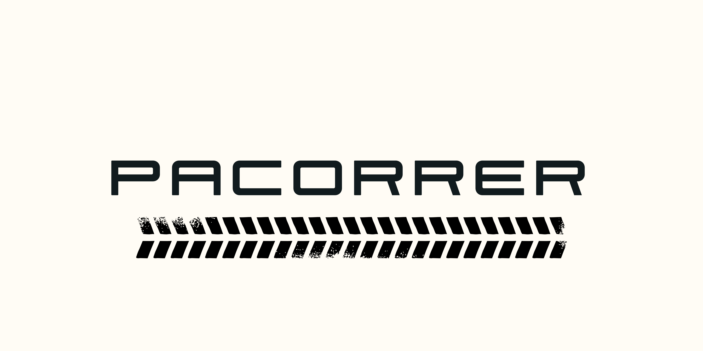

# Proyecto Final - Juego de Carreras Pacorrer

Bienvenido al proyecto final de nuestro juego de carreras. Este juego es mucho más que una simple competición de velocidad: aquí, los jugadores pueden experimentar una carrera totalmente inmersiva, personalizar sus vehículos, enfrentarse a una IA desafiante y realizar un seguimiento detallado de su rendimiento. A continuación, te presentamos un vistazo completo de las características, objetivos y narrativa del juego desde la perspectiva de los jugadores y de los desarrolladores.

### Historia del Juego

Eres un piloto en una serie de carreras de alta velocidad y desafío extremo. Compites en un circuito técnico y lleno de giros donde la velocidad, la habilidad y la estrategia son clave para la victoria. Pero no estás solo; otros coches controlados por IA intentan ganarte en cada curva, mientras tú trabajas para mantener la delantera. Con cada carrera, mejoras tus habilidades y personalizas tu coche, haciendo ajustes finos en la velocidad, la maniobrabilidad y el diseño visual. El objetivo es simple: ¡ser el mejor piloto del circuito!

### Futuro del Juego y Posibilidades de Expansión

Este juego de carreras ha sido diseñado para ser modular y escalable. Gracias a su arquitectura flexible, es fácil expandir sus características añadiendo nuevas pistas, coches, o incluso modos de juego. Además, la implementación de patrones de diseño como el Factory permite a los desarrolladores de mods integrar nuevas opciones de personalización y ajustes sin tocar la estructura del código principal.

#### Ideas para Expansión:
Nuevas pistas y desafíos
Modo multijugador
Opciones avanzadas de tuning para una personalización más detallada
Ranking global de puntuaciones
Clima dinámico que afecte la jugabilidad

Desarollado Por: Miguel Angel Vallejo de Bergia y Javier Viseras Comin

